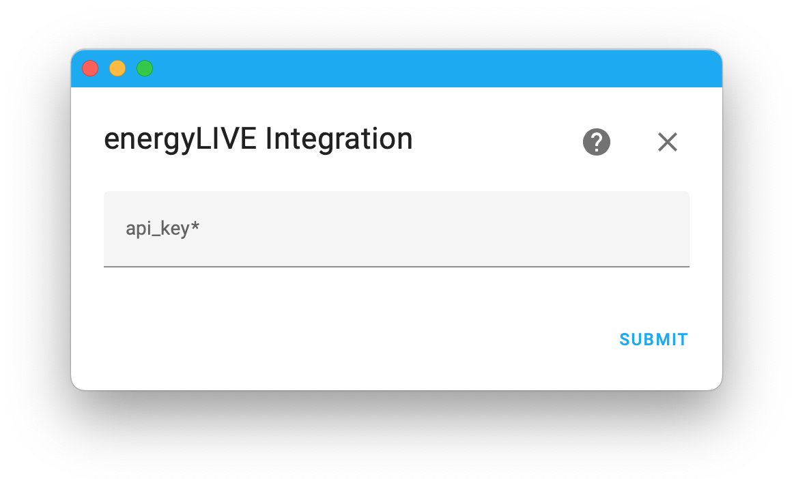

# Home Assitant Intergration for energyLIVE API

## About 

This custom compenent for [Home Assistant](https://www.home-assistant.io) provides integration with [energyLIVE](https://www.smartenergy.at/energylive).

## Installation

### HACS

1. Ensure that [HACS](https://hacs.xyz) is installed.

2. Open HACS, then select `Integrations`.

3. Select &#8942; and then `Custom repositories`.

4. Set `Repository` to *https://github.com/berwinter/ha_energylive*  
   and `Category` to _Integration_.

5. Install **energyLIVE** integration via HACS:

   

   If the button doesn't work: Open `HACS` > `Integrations` > `Explore & Download Repositories` and select integration `energyLIVE`.

### Manual

1. Copy the folder `custom_components/energylive` to `custom_components` in your Home Assistant `config` folder.

## Configure

1. Obtain energyLIVE API key via smartENERGY app or webpage:

2. Add energyLIVE custom integration in Home Assistant and provide your API key:

3. Your energyLIVE devices (interface and gateway) will be added in Home Assistant and it starts logging:

